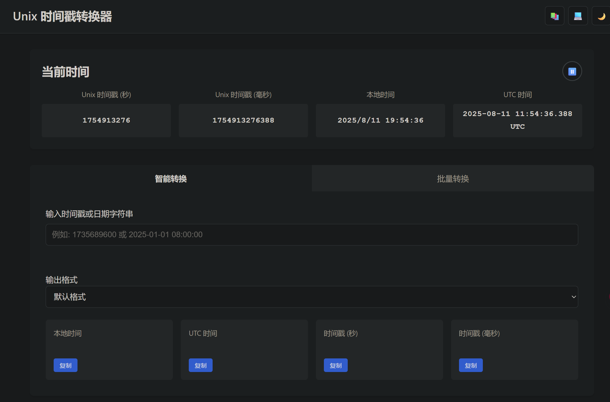

# Unix Timestamp Converter (全功能Unix时间戳转换器)

[](https://opensource.org/licenses/MIT)
[](https://www.javascript.com)
[](https://prettier.io/)

这是一个功能强大、界面美观且完全在客户端运行的 Unix 时间戳转换工具。它不仅提供了基础的时间戳与日期时间格式之间的双向转换，还集成了众多面向开发者的实用功能，如智能解析、批量处理、主题切换和代码示例等，旨在成为您开发过程中的一站式时间处理助手。

**[➡️ 查看在线演示 (Live Demo)](https://kashima19960.github.io/unix-timestamp/)** 



## ✨ 主要功能

  - **🕒 实时当前时间**:

      - 在页面顶部动态显示当前的 Unix 时间戳（秒和毫秒）。
      - 同步展示对应的本地时间和 UTC 时间，每秒自动更新。
      - **支持暂停/恢复**，方便您捕捉和分析特定时刻的时间数据。

  - **🔄 智能双向转换**:

      - **一个输入框，无限可能**：在同一个输入框内，您可以输入 Unix 时间戳（自动识别秒/毫秒，甚至支持微秒和纳秒级），或是多种格式的日期时间字符串。
      - **智能提示**: 系统会实时显示其解析逻辑（如“解析为毫秒级时间戳”或“解析为日期时间”），让您对转换过程一目了然。
      - **丰富格式输出**: 提供多种标准日期时间格式供您选择，包括 `ISO 8601`, `RFC 2822` 及多种本地化格式。

  - **🔢 批量处理**:

      - 高效的批量转换功能，允许您一次性输入多个时间戳（每行一个），并快速获得所有对应的日期时间结果。

  - **🎨 用户体验优化**:

      - **光明/黑暗主题切换**: 一键切换界面主题，适应不同光线环境下的使用习惯。您的偏好会被自动保存在本地。
      - **响应式设计**: 无论在桌面还是移动设备上，都能获得流畅一致的操作体验。
      - **一键复制**: 所有转换结果和代码示例旁都配有复制按钮，方便您快速取用。

  - **📚 开发者知识中心**:

      - **核心概念科普**: 通过弹窗模式，清晰地介绍了 Unix 时间戳、UTC、GMT 和时区等核心概念。
      - **多语言代码示例**: 集成了在 **Python, C++, Java, C\#, JavaScript, Go** 等十多种主流编程语言和环境中获取当前时间戳的代码片段，是绝佳的参考手册。

## 🚀 技术栈

本项目完全使用前端原生技术构建，确保了极致的性能和零依赖的轻量化体验。

  - **HTML5**: 采用语义化标签，结构清晰。
  - **CSS3**:
      - 使用 **CSS 变量 (Variables)** 实现流畅的主题切换。
      - 采用 Flexbox 和 Grid 进行现代化布局，并实现了全面的响应式设计。
  - **JavaScript (ES6+)**:
      - **无框架依赖**: 纯 Vanilla JS 编写，代码高效、可控。
      - **面向对象**: 整体逻辑被封装在 `UnixTimestampConverter` 类中，结构清晰，易于维护和扩展。
      - **事件驱动**: 充分利用事件监听实现实时交互。
      - **本地存储 (`localStorage`)**: 用于持久化用户的主题偏好。

## 🛠️ 安装与使用

本项目无需任何后端或复杂的构建过程。

1.  **克隆仓库**:

    ```bash
    git clone https://github.com/kashima19960/unix-timestamp.git
    ```

2.  **打开文件**:
    直接在浏览器中打开 `index.html` 文件即可开始使用。

    ```bash
    # (在项目目录下)
    # Windows
    start index.html
    # macOS
    open index.html
    # Linux
    xdg-open index.html
    ```

## 📜 开源协议

本项目基于 [MIT License](https://opensource.org/licenses/MIT) 开源。